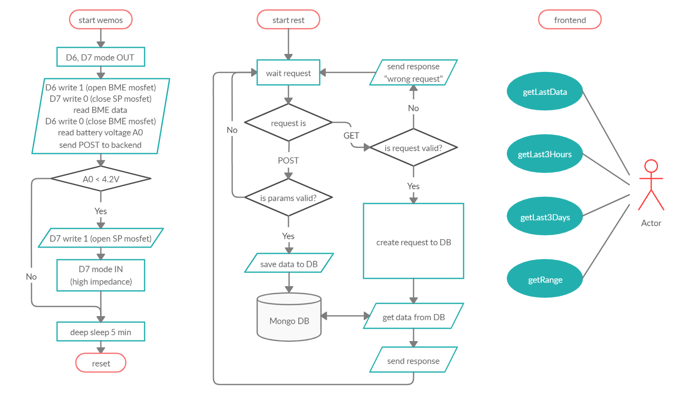
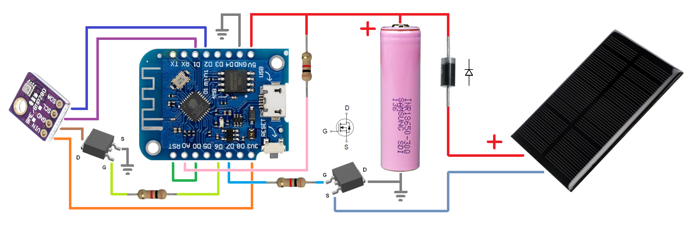

# meteo api
/data?start=START_DATE&finish=FINISH_DATE
 
/ - to get lastDataset

## Frontend for this api
https://github.com/alexanderkif/meteo-front

## UML

## Wemos/Arduino

## Arduino IDE sketch
### ./arduino/MeteoBasicHttpsClient.ino