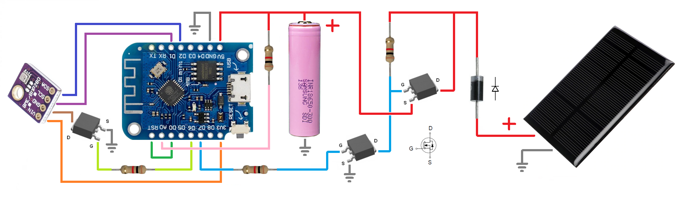
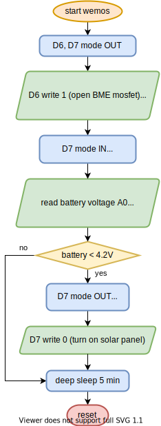

# Meteo API
## Deployed on zeit.co
### https://zeit.co/docs
### GET
<code>/data?start=<b>START_DATE</b>&finish=<b>FINISH_DATE</b>&tframe=<b>TFRAME</b>&step=<b>STEP</b></code> - universal request to backend 
<code>/data</code>  - to get 3 hours datasets 
<code>/</code> - to get lastDataset 

### POST
<code>/data</code> - to send current dataset to MongoDB 
<code>String postMessage = "temperature=" + temperature + "&humidity=" + humidity + "&pressure=" + pressure + "&altitude=" + altitude + "&battery=" + battery + "&key=" + myKey;</code>

## Frontend for this API
### https://github.com/alexanderkif/meteo-front

### How backend works

## Wemos/Arduino circuitry

### How arduino works

## Arduino IDE sketch
### https://github.com/alexanderkif/meteo/blob/master/arduino/MeteoBasicHttpsClient.ino
